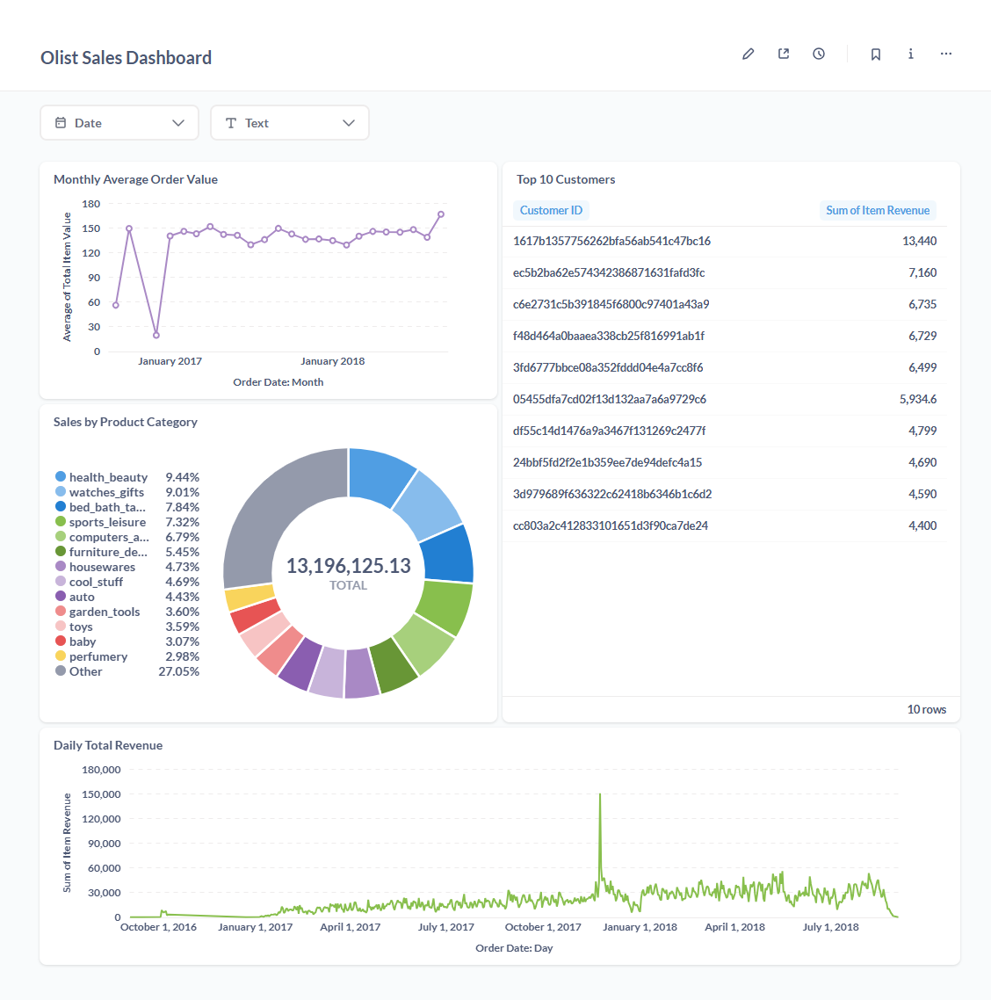

# Olist E-commerce Data Analytics Project

## 📌 Project Overview

This project focuses on building a robust data analytics pipeline for an e-commerce company (simulated using the Olist Brazilian E-commerce Public Dataset). The goal is to transform raw transactional data into meaningful insights for business analysis using modern data stack tools.

## Technologies Used

* **Google BigQuery:** Cloud Data Warehouse for scalable data storage and querying.
* **dbt (data build tool):** For data transformation, modeling, and establishing a single source of truth for analytics.
* **Metabase:** Open-source Business Intelligence tool for data visualization and dashboarding.
* **Python/Pip/Virtual Environments:** For environment management and (optional) data generation.
* **Git/GitHub:** For version control and collaborative development.

## Project Architecture
Raw CSVs (Local)
↓
BigQuery (olist_raw Dataset)
↓ (Transformed by dbt)
BigQuery (olist_marts Dataset: Staging, Dimensions, Facts)
↓
Metabase (Data Visualization & Dashboards)

## 📂 Data Sources

The project utilizes the [Brazilian E-commerce Public Dataset by Olist on Kaggle](https://www.kaggle.com/datasets/olistbr/brazilian-ecommerce).
Key tables used:
* `olist_orders_dataset.csv`
* `olist_order_items_dataset.csv`
* `olist_products_dataset.csv`
* `olist_customers_dataset.csv`
* `product_category_name_translation.csv`

## Data Modeling with dbt

The dbt project implements a layered data modeling approach:

1.  **Staging Layer (`stg_` models):**
    * Direct selection from raw BigQuery tables.
    * Basic cleaning (e.g., casting data types, handling `NULL`s).
    * Renaming columns for consistency (e.g., `order_purchase_timestamp` to `order_purchased_at`).
    * Examples: `stg_olist_orders`, `stg_olist_products`, `stg_olist_customers`, `stg_olist_order_items`, `stg_product_category_name_translation`.

2.  **Marts Layer (`dim_` and `fct_` models):**
    * **Dimensions (`dim_` tables):** Conformed dimensions providing context.
        * `dim_products`: Contains product details, including English category names (joined with `product_category_name_translation`) and a **simulated `cost_of_goods_sold` (COGS)** for profit calculations.
        * `dim_customers`: Contains customer demographics.
    * **Facts (`fct_` tables):** Aggregated metrics for analysis.
        * `fct_daily_sales`: Core sales fact table, aggregated by `order_date`, `product_id`, and `customer_id`. Includes calculated `item_revenue` and `item_profit`. This table is partitioned and clustered in BigQuery for performance.

## Key Metrics & Insights

The Metabase dashboards provide insights into:
* **Total Revenue & Profit over time** (daily, monthly).
* **Sales performance by Product Category** (e.g., top-selling categories).
* **Average Order Value (AOV)** trends.
* **Geographical sales distribution** (sales by customer state/city).
* **Top-performing products**.

## How to Run This Project

Follow these steps to set up and run this project locally:

1.  **Clone the Repository:**
    ```bash
    git clone [https://github.com/your-username/your-repo-name.git](https://github.com/your-username/your-repo-name.git)
    cd your-repo-name
    ```
2.  **Google Cloud Platform Setup:**
    * Ensure you have a GCP project with billing enabled.
    * Create two BigQuery datasets: `olist_raw` (for raw data) and `olist_marts` (for dbt output), both in the same location (e.g., `US` or `EU`).
    * Create a Google Cloud Service Account with `BigQuery Data Editor` and `BigQuery Job User` roles. Download its JSON key file and save it securely (e.g., `C:\Users\YourUsername\.dbt_keys\your-key-file.json`). **DO NOT commit this file to Git.**
    * Upload the 5 Olist CSV files (`olist_orders_dataset.csv`, `olist_order_items_dataset.csv`, `olist_products_dataset.csv`, `olist_customers_dataset.csv`, `product_category_name_translation.csv`) to your `olist_raw` BigQuery dataset. *Ensure BigQuery correctly detects header rows and data types (especially for timestamps).* If not, adjust `stg_` models accordingly.

3.  **Local Environment Setup:**
    * Install Python 3.
    * Create and activate a Python virtual environment:
        ```bash
        python -m venv venv
        # On Windows: .\venv\Scripts\Activate.ps1
        # On macOS/Linux: source venv/bin/activate
        ```
    * Install the dbt BigQuery adapter:
        ```bash
        pip install dbt-bigquery
        ```
4.  **Configure dbt Profile:**
    * Locate your dbt `profiles.yml` file (typically `~/.dbt/profiles.yml` or `%USERPROFILE%\.dbt\profiles.yml`).
    * Add/update the profile for `olist_ecommerce_analysis` to point to your GCP Project ID, `olist_marts` dataset, and the full path to your service account JSON key file.

    ```yaml
    # Example profiles.yml entry
    olist_ecommerce_analysis:
      target: dev
      outputs:
        dev:
          type: bigquery
          method: service-account
          project: [YOUR_GCP_PROJECT_ID]
          dataset: olist_marts
          threads: 4
          keyfile: [FULL_PATH_TO_YOUR_KEYFILE.JSON]
          location: [YOUR_BIGQUERY_LOCATION]
          priority: interactive
    ```
5.  **Run dbt Models:**
    * From your project root (where `dbt_project.yml` is located, with your venv active):
        ```bash
        dbt debug # To test connection
        dbt clean # Optional: clear old builds
        dbt run   # To build all models
        dbt test  # To run data quality tests (after adding them!)
        ```
6.  **Set up Metabase (via Docker):**
    * Install Docker Desktop.
    * Run Metabase: `docker run -d -p 3000:3000 --name metabase_olist metabase/metabase`
    * Access Metabase at `http://localhost:3000` and complete the initial setup.
7.  **Connect Metabase to BigQuery:**
    * In Metabase Admin settings > Databases, add a new BigQuery database.
    * Use your GCP Project ID, `olist_marts` as the Dataset ID, and paste the content of your service account JSON key.
8.  **Explore Data & Build Dashboards:**
    * Create questions and dashboards in Metabase using the `fct_daily_sales`, `dim_products`, and `dim_customers` tables.

## Project Status & Future Enhancements

* **Current Status:**

    * Staging and mart models are implemented.
    * All core data models are built and accessible in Metabase.
    * Data is loaded and explored in Metabase

* **Future Enhancements:**
    * Adding more detailed data quality tests with dbt (e.g., `not_null`, `unique`, `accepted_values`).
    * Implementing incremental models for `fct_daily_sales` to optimize run times.
    * Integrating `olist_order_reviews_dataset` for sentiment analysis.
    * Building customer segmentation (e.g., RFM analysis).
    * Automating dbt runs with a scheduler like Google Cloud Composer (Apache Airflow) or dbt Cloud.
    * Exploring more advanced Metabase features or integrating with another BI tool like Looker Studio.

---
### **Metabase Dashboard Screenshots**


* Screenshot of Main Dashboard: 
